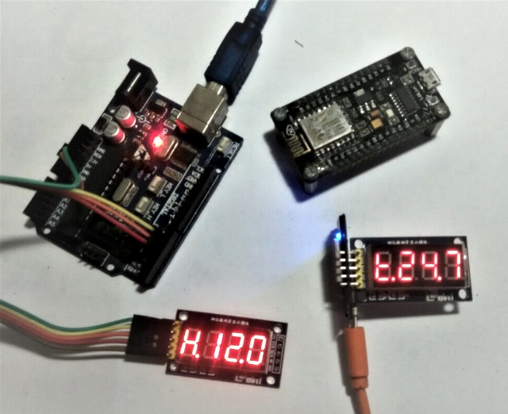
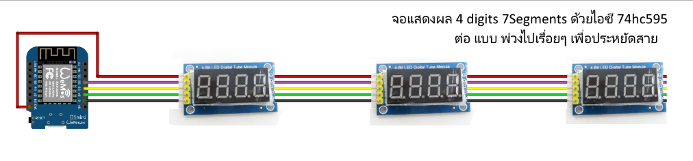

TridentTD_7Segs74HC595
============
[TridentTD]  7segments (74hc595)  Library for ESP8266/Arduino
---------------------------------------------

**TridentTD_7Segs74HC595** is a library for  digital-tube 7segments module (74hc595) 
for both ***Arduino*** and ***ESP8266***.

- **TridentTD_7Segs74HC595**    *my7SEGMENT( **SCLK**, **RCLK**, **DIO**);*
- my7SEGMENT.**init**();
- my7SEGMENT.**setNumber**( float number, int decimal );
- my7SEGMENT.**setText**( String text);
- my7SEGMENT.**setTextScroll**( String text);

สามารถต่อพ่วงออกไปเรื่อยๆ และควบคุมแบบแยกโมดูลกันได้

- **TridentTD_7Segs74HC595**    *my7SEGMENT( **SCLK**, **RCLK**, **DIO**, **จำนวนโมดูลที่จะต่อพ่วง**);*

- my7SEGMENT.**addModule**( ตั้งชื่อโมดูล);

- my7SEGMENT.**init**();

- my7SEGMENT.**setNumber**( ชื่อโมดูล, number, decimal);

- my7SEGMENT.**setText**(ชื่อโมดูล, text);

- my7SETMENT.**setTextScroll**(ชื่อโมดูล, text);

euk)  

Version
=====

1.0.0  **TridentTD_7Segs74HC595**   
25 May 2560BE (Buddism Era), 2017  
  
2.0.0 27 May 2560BE  
  
2.1   21 July 2562BE เพิ่มให้สามารถเรียง 7Segments กลับจากซ้ายไปขวา ขวาไปซ้ายด้านได้  
  
V. Phaisarn  
